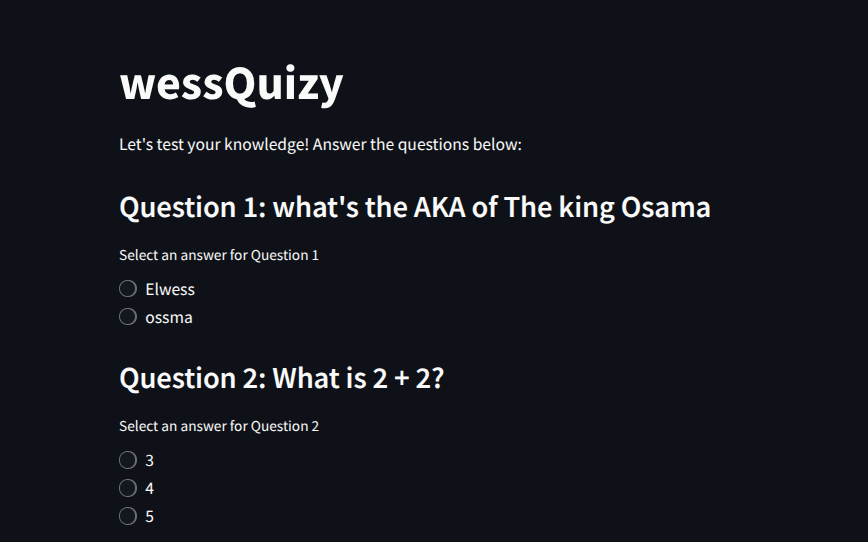
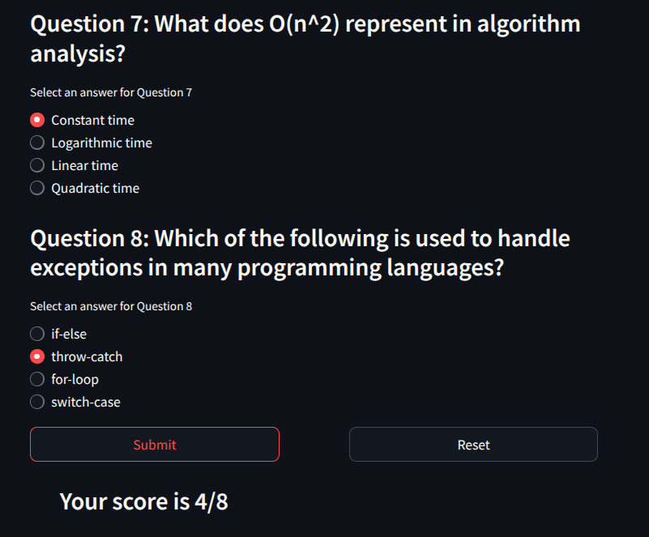

# 📚 WessQuizy

**WessQuizy** is a full-stack quiz platform where users can take quizzes, submit answers, and get instant feedback. It combines a modern Python backend with a friendly Streamlit frontend.

## 🧰 Tech Stack

- ⚙️ **Backend**: [FastAPI](https://fastapi.tiangolo.com/) – blazing fast, modern Python web framework
- 🛢️ **Database**: PostgreSQL – powerful and reliable relational database
- 🎨 **Frontend**: [Streamlit](https://streamlit.io/) – elegant Python app framework for UI
- 🐘 **ORM**: SQLAlchemy – for database models and querying
- 🔐 **Pydantic** – for data validation

---

## 🚀 Features

- Add and manage questions and choices
- Mark correct answers
- Validate user input using Pydantic
- Interactive frontend for taking quizzes
- PostgreSQL for persistent data storage

---

## 🖥️ Screenshots

